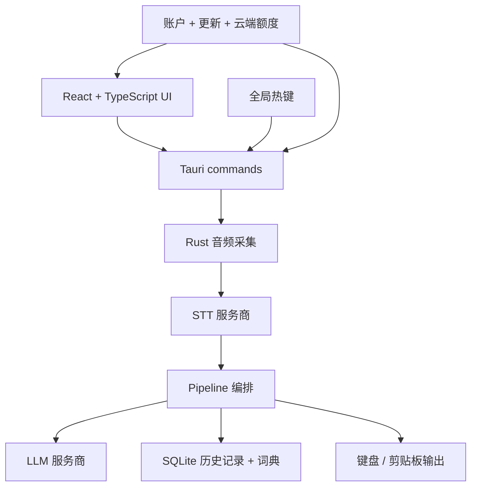

<p align="center">
  <a href="README.md">English</a> | <strong>中文</strong> | <a href="README_ja.md">日本語</a> | <a href="README_ko.md">한국어</a> | <a href="README_es.md">Español</a> | <a href="README_fr.md">Français</a> | <a href="README_de.md">Deutsch</a> | <a href="README_pt.md">Português</a> | <a href="README_ru.md">Русский</a> | <a href="README_ar.md">العربية</a> | <a href="README_hi.md">हिन्दी</a> | <a href="README_it.md">Italiano</a> | <a href="README_tr.md">Türkçe</a> | <a href="README_vi.md">Tiếng Việt</a> | <a href="README_th.md">ภาษาไทย</a> | <a href="README_id.md">Bahasa Indonesia</a> | <a href="README_pl.md">Polski</a> | <a href="README_nl.md">Nederlands</a>
</p>

> [!IMPORTANT]
> **Fork status:** This is the **Rudy774 fork**, which differs from the original OpenTypeless project. Source code, releases, and support are provided only through [github.com/rudy774/opentypeless](https://github.com/rudy774/opentypeless). This fork does **not** currently provide a hosted paid service, and automatic updates are disabled.

<p align="center">
  
</p>

<h1 align="center">OpenTypeless</h1>

<p align="center">
  开源版 Wispr Flow / Superwhisper：面向 macOS、Windows 和 Linux 的 AI 语音输入、改写和语音问答工具。
</p>

<p align="center">
  无论你在写邮件、写代码、聊天还是做笔记 — 只需按下热键，<br/>
  说出你的想法，OpenTypeless 会用 AI 转录并润色你的语音，<br/>
  然后直接输入到你正在使用的任何应用中。
</p>

<p align="center">
  如果 OpenTypeless 对你的工作流有帮助，欢迎点一个 GitHub Star，让更多人发现这个项目。
</p>

<p align="center">
  <strong>任意应用听写</strong> · <strong>改写选中文本</strong> · <strong>语音 Ask 一次性问答</strong> · <strong>自备密钥或使用托管 cloud words</strong>
</p>

<p align="center">
  <a href="https://github.com/rudy774/opentypeless/actions/workflows/ci.yml"></a>
  <a href="https://github.com/rudy774/opentypeless/releases"></a>
  <a href="LICENSE"></a>
  <a href="https://github.com/rudy774/opentypeless/stargazers"></a>
</p>

<p align="center">
  
</p>

<p align="center">
  
</p>

## Inherited upstream capabilities

The capabilities below originated in the upstream project before this fork. This is historical attribution, not a release-version or support claim.

- **应用感知写作**会在本地识别当前应用，并针对邮件、聊天、文档、Issue 跟踪、开发工具等场景调整结构和语气。
- **语音意图路由**可区分普通听写、选中文本编辑、翻译、Ask Anything 和受支持的语音操作，并支持简体中文、繁体中文和英文。
- **每个工作流支持多个快捷键**，可为听写、Ask Anything 和翻译分别添加和排序多个按键组合。
- **可切换翻译目标语言**，无需始终固定为同一种输出语言。
- **更完整的本地词典**支持纠错规则以及词典导入导出。
- **按应用设置写作风格**，可覆盖内置应用分类，为特定应用指定其他写作场景。

应用识别、映射、词典和纠错规则都保存在本地。应用感知润色只会向配置的 LLM 发送内部应用分类和经过审核的风格元数据；原始窗口标题和文档内容不会作为应用上下文发送，也不会写入历史记录。

| 应用感知 AI 润色 | 本地词典与纠错规则 |
| --- | --- |
|  |  |

<details>
<summary>更多截图</summary>

<p align="center">
  
</p>

| 设置 | 历史记录 |
|---|---|
|  |  |

</details>

---

## Ask Anything

Ask Anything 不是聊天页，也不是另一个输入框。它是一个快捷键优先的语音问答流程：按下 Ask 热键，说出问题，停止录音后，OpenTypeless 会先转写问题，再调用 LLM，最后只把答案显示在一个小便签里。

它适合临时问一句、快速查一句、让 AI 根据当前选中文本解释/总结/改写一句。默认没有聊天历史、没有输入框、没有额外发送按钮，结果可以直接复制。

默认热键对齐 Typeless 风格：

| 平台 | 听写 | Ask Anything | 翻译选中文本 |
|---|---|---|---|
| macOS | `Fn` | `Fn+Space` | `Fn+LeftShift` |
| Windows | `Right Alt` | `Right Alt+Space` | `Right Alt+LeftShift` |
| Linux | `Ctrl+/` | `Ctrl+.` | 可配置 |

Linux 暂时保持 `Ctrl+/` 和 `Ctrl+.` 作为默认热键，因为不同桌面环境，尤其是 Wayland 下，全局 `Right Alt` 监听不如 Windows 稳定。

## 为什么选择 OpenTypeless？

| | OpenTypeless | macOS 听写 | Windows 语音输入 | Whisper Desktop |
|---|---|---|---|---|
| AI 文本润色 | ✅ 多种 LLM | ❌ | ❌ | ❌ |
| Ask Anything 语音问答 | ✅ | ❌ | ❌ | ❌ |
| STT 服务商选择 | ✅ Cloud、Deepgram、AssemblyAI、Whisper 兼容、Doubao 等 | ❌ 仅 Apple | ❌ 仅 Microsoft | ❌ 仅 Whisper |
| 适用于任意应用 | ✅ | ✅ | ✅ | ❌ 需复制粘贴 |
| 翻译模式 | ✅ | ❌ | ❌ | ❌ |
| 选中文本改写 | ✅ | ❌ | ❌ | ❌ |
| 开源 | ✅ MIT | ❌ | ❌ | ✅ |
| 跨平台 | ✅ Win/Mac/Linux | ❌ 仅 Mac | ❌ 仅 Windows | ✅ |
| 自定义词典 | ✅ | ❌ | ❌ | ❌ |
| 可自托管 | ✅ BYOK | ❌ | ❌ | ✅ |

## 功能特性

- 🎙️ 默认对齐 Typeless 风格热键：macOS `Fn`，Windows `Right Alt`，Linux `Ctrl+/`
- ❓ 独立 Ask Anything 热键：macOS `Fn+Space`，Windows `Right Alt+Space`，Linux `Ctrl+.`
- 💊 浮动胶囊显示准备、录音、转写、润色、Ask thinking 等状态，空闲时可自动隐藏
- 🗣️ 接入 6+ 语音识别服务商，并支持 macOS Apple Speech 与自托管 Whisper 兼容端点
- 🤖 多种大模型润色文本：OpenAI、DeepSeek、Claude、Gemini、Ollama 等
- ✨ 润色风格：轻改、清爽、结构化、专业
- ⚡ 流式输出，边生成边打字
- ⌨️ 支持键盘模拟、剪贴板粘贴/仅复制、Windows SendInput 和输出失败诊断
- 📝 Ask/润色可读取选中文本，用来提问、总结、改写或翻译
- 🌐 翻译模式：说中文，输出英文（或其他 20+ 语言）
- 📖 自定义词典和本地纠错规则，提升专业术语与常见错词处理
- 🧩 内置场景、本地自定义场景、导入导出和激活状态
- 🔐 BYOK 密钥优先存入系统密钥库，尽量避免明文保存在配置里
- 🔍 自动识别当前应用，适配不同场景
- 📜 本地历史记录，支持全文搜索
- 🌗 深色 / 浅色 / 跟随系统主题
- 🚀 开机自启

> 界面本地化目前以英文和中文最完整；其他语言包已覆盖 key，但部分新功能和高级设置仍可能回退显示英文。

> [!TIP]
> **推荐配置（开箱即用最佳体验）**
>
> | | 服务商 | 模型 |
> |---|---|---|
> | 🗣️ 语音识别 | Groq | `whisper-large-v3-turbo` |
> | 🤖 AI 润色 | Google | `gemini-2.5-flash` |
>
> 这套组合转录速度快、准确率高，文本润色质量出色，而且两者都提供慷慨的免费额度。

## 下载安装

下载适用于你平台的最新版本：

**[前往 Releases 下载](https://github.com/rudy774/opentypeless/releases)**

| 平台 | 文件 |
|------|------|
| Windows | `.msi` 安装包或 `.exe` 安装程序 |
| macOS | Apple Silicon 和 Intel 通用 `.dmg` |
| Linux | `.AppImage` / `.deb` / `.rpm` |

## Installation Notes

Only install artifacts published by the [Rudy774 fork](https://github.com/rudy774/opentypeless/releases), or builds you create yourself from reviewed source. Public Windows installers must have a valid publisher signature, and public macOS builds must be Developer ID signed and notarized.

### Windows

If Windows cannot validate the publisher or SmartScreen reports an unrecognized app, stop and do not continue past the warning. Delete the installer and report the affected release in the [Rudy774 issue tracker](https://github.com/rudy774/opentypeless/issues).

### macOS

If Gatekeeper reports that the app is from an unidentified developer, is damaged, or cannot be checked for malicious software, do not remove quarantine attributes. Delete the download and report the affected release in the [Rudy774 issue tracker](https://github.com/rudy774/opentypeless/issues).

### Linux

**Ubuntu/Debian** 安装 `.deb`：

```bash
sudo apt install ./OpenTypeless_x.x.x_amd64.deb
```

**AppImage** 直接运行：

```bash
chmod +x OpenTypeless_x.x.x_amd64.AppImage
./OpenTypeless_x.x.x_amd64.AppImage
```

**NVIDIA + Wayland 用户：**应用会自动识别并应用兼容处理。如果仍然启动崩溃，可以尝试：

```bash
WEBKIT_DISABLE_DMABUF_RENDERER=1 ./OpenTypeless
```

**Wayland 用户：**全局热键和自动粘贴会受到桌面环境限制。OpenTypeless 会在设置中提示，并可退回到托盘/应用内控制或仅复制输出。

## 前置要求

- [Node.js](https://nodejs.org/) 20+
- [Rust](https://rustup.rs/)（stable 工具链）
- Tauri 平台依赖：参见 [Tauri 前置要求](https://v2.tauri.app/start/prerequisites/)

## 快速开始

```bash
# 安装依赖
npm install

# 开发模式运行
npm run tauri dev

# 构建生产版本
npm run tauri build
```

构建产物位于 `src-tauri/target/release/bundle/`。

## 配置

所有设置均可在应用内的设置面板中访问：

- **语音识别** — 选择 STT 服务商并输入 API 密钥
- **AI 润色** — 选择 LLM 服务商、模型、API 密钥、润色风格、自定义提示词、翻译和选中文本上下文
- **通用** — 听写热键、Ask 热键、输出模式、开机自启和胶囊空闲隐藏
- **词典** — 添加自定义术语和本地纠错规则
- **场景** — 内置/本地提示词模板，支持导入导出
- **账户 / Upgrade** — 登录、查看 cloud words、管理 Pro 或 Lifetime Starter 权益

API 密钥会优先存入系统密钥库，不支持时使用本地 fallback。BYOK 密钥不会发送到 OpenTypeless 服务器 — 所有 STT/LLM 请求直接发送到你配置的服务商。

### Managed service status for this fork

This fork currently supports bring-your-own-key and local providers. It does not include a hosted paid service. Account, entitlement, checkout, backup, and managed transcription features remain disabled unless you build and operate a compatible backend yourself.

A self-hosted managed backend must be configured explicitly at build time with both `VITE_MANAGED_API_BASE_URL` and `OPENTYPELESS_MANAGED_API_BASE_URL`. There is no production default. Both values must be the same owned HTTPS origin; see `docs/MANAGED_SERVICE_API.md` and `docs/COMMERCIALIZATION.md`.
## 架构

**桌面端 Pipeline：**



```
src/                  # React 前端（TypeScript）
├── components/       # UI 组件（Settings、History、Capsule 等）
├── hooks/            # React hooks（录音、主题、Tauri 事件）
├── lib/              # 工具库（API 客户端、路由、常量）
└── stores/           # Zustand 状态管理

src-tauri/src/        # Rust 后端
├── audio/            # 音频采集（cpal）
├── stt/              # STT 服务商（Deepgram、AssemblyAI、Whisper 兼容、Cloud）
├── llm/              # LLM 服务商（OpenAI 兼容、Cloud）
├── output/           # 文本输出（键盘模拟、剪贴板粘贴）
├── storage/          # 配置（tauri-plugin-store）+ 历史/词典（SQLite）
├── app_detector/     # 检测当前活动应用
├── pipeline.rs       # 录音 → STT → LLM → 输出 编排
└── lib.rs            # Tauri 应用设置、命令、热键处理
```

## 路线图

- [ ] 用量统计 UI：汇总音频时长和字数消耗
- [ ] 更细的服务商配置诊断
- [ ] 更清晰的 Linux 桌面环境兼容说明
- [ ] 更多工作流预设：写作、代码、客服回复等
- [ ] 插件式服务商扩展

## 常见问题

**我的音频会上传到云端吗？**
在 BYOK 模式下，音频直接发送到你选择的 STT 服务商或本地端点，不经过 OpenTypeless 服务器。在 Cloud 模式下，音频会发送到托管代理，用于转录和额度统计。

**可以离线使用吗？**
使用本地 STT 服务商（通过 Ollama 运行 Whisper）和本地 LLM（Ollama），应用可以完全离线工作，无需网络连接。

**支持哪些语言？**
STT 根据服务商不同支持 99+ 种语言。AI 润色和翻译支持 20+ 种目标语言。

**应用免费吗？**
是的。使用自己的 API 密钥（BYOK）即可完整使用所有功能。Cloud 计划是可选的。

## 社区

- 🗣️ [GitHub Discussions](https://github.com/rudy774/opentypeless/discussions) — 功能提案、问答
- 🐛 [Issue Tracker](https://github.com/rudy774/opentypeless/issues) — Bug 报告和功能请求
- 📖 [贡献指南](CONTRIBUTING.md) — 开发环境搭建和贡献规范
- 🔒 [安全策略](SECURITY.md) — 负责任地报告漏洞
- 🧭 [愿景](VISION.md) — 项目原则和路线图方向

## 贡献

欢迎贡献！请参阅 [CONTRIBUTING.md](CONTRIBUTING.md) 了解开发设置和指南。

寻找入手点？查看标记为 [`good first issue`](https://github.com/rudy774/opentypeless/labels/good%20first%20issue) 的 issue。

## Star History

<a href="https://star-history.com/#rudy774/opentypeless&Date">
  <picture>
    <source media="(prefers-color-scheme: dark)" srcset="https://api.star-history.com/svg?repos=rudy774/opentypeless&type=Date&theme=dark" />
    <source media="(prefers-color-scheme: light)" srcset="https://api.star-history.com/svg?repos=rudy774/opentypeless&type=Date" />
    
  </picture>
</a>

## 借助 Claude Code 一天完成开发

整个项目在一天之内借助 [Claude Code](https://claude.com/claude-code) 完成开发 — 从架构设计到完整实现，包括 Tauri 后端、React 前端、CI/CD 流水线以及本 README。

## 许可证

[MIT](LICENSE)
