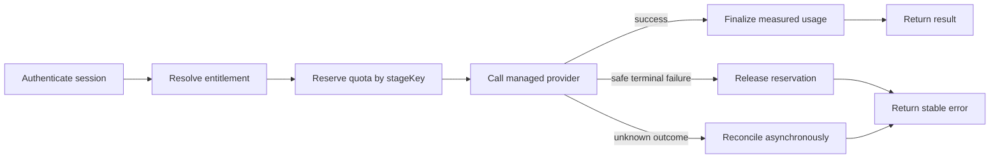

# Managed Service API Contract

This is the implementation contract for a future Rudy-owned OpenTypeless managed service. It is paired with [`managed-service.openapi.json`](managed-service.openapi.json), which is checked in CI by `npm run service:contract:check`.

The desktop remains useful without this service. BYOK transcription, local history, shortcuts, dictionary, scenes, and AI cleanup must never depend on an account or this API. A commercial build may expose managed features only when a real HTTPS service origin is supplied at build time and passes the commercial release guard.

## Product surface

The managed service is responsible for the paid capabilities already represented in the desktop client:

| Capability      | Contract                                                                                                                                                                                                                                                                                                                                                                     |
| --------------- | ---------------------------------------------------------------------------------------------------------------------------------------------------------------------------------------------------------------------------------------------------------------------------------------------------------------------------------------------------------------------------- |
| Accounts        | Better Auth-compatible email/password and OAuth flows; desktop sessions return `set-auth-token` and can be revoked server-side.                                                                                                                                                                                                                                              |
| Entitlements    | `GET /api/subscription/status` is authoritative for plan, license status, quota model, limits, use, and reset dates.                                                                                                                                                                                                                                                         |
| Checkout        | `POST /api/checkout/create` accepts the desktop payload `{ origin, product }` plus `Idempotency-Key`, then returns an exact one-field response containing a short-lived HTTPS URL on the configured managed API origin. The external browser follows that managed endpoint to the billing provider; the server validates the product ID and remains authoritative for price. |
| Billing portal  | `POST /api/subscription/portal` returns the same exact managed-origin URL shape; the external browser follows it to the customer portal.                                                                                                                                                                                                                                     |
| Managed speech  | `POST /api/proxy/stt` accepts WAV audio and returns a transcript. Provider credentials never reach the desktop.                                                                                                                                                                                                                                                              |
| Managed cleanup | `POST /api/proxy/llm` accepts messages plus bounded metadata and returns cleaned text or an OpenAI-compatible stream.                                                                                                                                                                                                                                                        |
| Voice Ask       | `POST /api/proxy/ask` returns a concise answer for a bounded question and optional bounded selected text.                                                                                                                                                                                                                                                                    |
| Backup/sync     | Explicit upload/download of a versioned, schema-1 snapshot carrying bounded history records, dictionary entries/rules, and portable preferences. Provider selection, endpoint routing, models, resource IDs, and BYOK credentials remain device-local and are never uploaded or restored.                                                                                    |
| Curated packs   | `GET /api/scenes` returns optional server-curated packs; local scenes remain free and offline.                                                                                                                                                                                                                                                                               |
| Portability     | Authenticated account export and deletion endpoints support privacy and support obligations.                                                                                                                                                                                                                                                                                 |

## Non-negotiable invariants

1. Every authenticated response is scoped from the verified server session, never a user ID supplied by the client.
2. The server owns plan and price identifiers. Unknown plans do not unlock service.
3. Billable operations use an atomic reservation/finalization ledger. The tuple `(account_id, stage_key)` is unique, so desktop retries cannot double-charge.
4. `operationId` links STT, cleanup, and Ask stages for support without containing transcript content. `stageKey` identifies one billable stage.
5. A reservation is created before an upstream provider call. It is finalized with measured usage on success and released or reconciled after a terminal failure.
6. A supplied but expired/revoked session returns HTTP 401 with `error.code = AUTH_SESSION_INVALID`. The desktop uses this exact code to clear its native session.
7. Quota exhaustion returns HTTP 403 with a stable quota code. Do not put raw provider responses in the error envelope.
8. Logs and traces may contain request ID, account hash, endpoint, stable error code, provider class, duration, and numeric usage. They must not contain audio, transcripts, prompts, selected text, bearer tokens, provider keys, or backup payloads.
9. Backup upload is capped at 8 MiB encoded, JSON depth 8, 5,000 history entries, 10,000 dictionary entries, 10,000 correction rules, 100 custom scenes, and three bindings per hotkey role. Every object uses an explicit allow-list with `additionalProperties: false`; limit or schema violations return a content-free 413/422 error before storage.
10. Audio and prompt content are retained only for the time required to complete the requested operation unless the user separately opts into a disclosed retention feature.

## Quota and idempotency lifecycle

Suggested ledger fields are `account_id`, `operation_id`, `stage_key`, `request_type`, `status`, `reserved_units`, `settled_units`, `provider_class`, `created_at`, `settled_at`, and `request_id`. Store no content-bearing fields in the ledger.

Checkout, backup upload, account export, and account deletion use the `Idempotency-Key` header. The current desktop generates a cryptographically random UUID for each new checkout or backup intent. A caller that retries the same intent must retain its original key. The service stores a unique `(account_id, route, idempotency_key)` record and replays the original status and response; it must reject reuse of one key with a different request digest.

## Authentication boundary

The persisted desktop bearer token belongs only in the operating-system credential vault. In the current client, an authenticated session also loads the bearer into native process memory and the main WebView's JavaScript module memory so WebView requests can authorize managed operations. Every managed-service request made by the desktop WebView is bearer-only and explicitly uses `credentials: 'omit'`; it never sends ambient browser cookies. External-browser OAuth uses a separate browser cookie context and returns only a one-time code plus state to the app. The bearer is not persisted in Web Storage, a Tauri store, logs, crash reports, or backup data. This memory-only WebView design reduces persistence exposure but is **not XSS-proof**; managed HTTP must move behind a native request proxy before the product claims WebView token isolation. OAuth never carries a bearer token in a URL. The desktop stores only a short-lived PKCE verifier, client state, and expiry in sessionStorage, consumes that transaction once, and clears legacy browser state.

The desktop begins OAuth with GET /api/auth/desktop-oauth using provider and callbackURL. The callback URL is created with the configured API origin and /auth/callback path, then desktop state, code_challenge, and code_challenge_method=S256 parameters. The bridge must parse rather than prefix-match it, require the exact configured HTTPS origin and path, reject URL credentials and fragments, require exactly those three query values, validate their shapes, and bind the state and challenge to a short-lived one-time server transaction. After provider authentication, the registered application deep link contains only a one-time code and the client state; it never contains a bearer token.

The desktop independently compares and atomically consumes its state and verifier before calling unauthenticated POST /api/auth/desktop/exchange with exactly code and codeVerifier. The service must atomically consume the code, require it to be unexpired (five minutes maximum), hash the verifier with SHA-256, compare it in constant time to the bound S256 challenge, rate-limit failed exchanges, and return Cache-Control: no-store. Replay, expiry, malformed input, or verifier mismatch returns a content-free stable error and never issues a token. The client validates the exchanged token against GET /api/auth/get-session before storing it in module memory or the OS vault. Codes, state, verifiers, and tokens must never enter logs, telemetry, referrers, or browser history. Arbitrary callback origins are never allowed.
The production API must enforce:

- TLS only, HSTS, a narrow CORS allow-list, and no wildcard credentialed origins;
- short-lived access sessions with rotation and server-side revocation;
- rate limits by account, IP risk band, and endpoint cost;
- CSRF protection for cookie-authenticated browser flows;
- bearer authentication for native proxy, quota, backup, export, and deletion calls; and
- audit events for sign-in, token rotation/revocation, checkout, entitlement changes, backup, export, and deletion without storing sensitive payloads.

Hosted checkout and portal responses contain exactly one bounded HTTPS `url` on the configured managed API origin, with no credentials or fragment. The desktop opens that managed endpoint in the external browser; the service may then redirect to the payment provider. The WebView never opens a provider-supplied arbitrary origin directly.

## Billing lifecycle

The payment webhook handler must verify signatures against the raw request body, reject stale/replayed events, and store the processor event ID uniquely. Entitlement updates must be idempotent and cover purchase, renewal, failed payment, cancellation, expiration, refund, dispute, and plan change. The subscription status endpoint reads the reconciled entitlement table, not webhook payloads or client assertions.

Before offering a lifetime plan with recurring managed inference, approve a cost model and a hard service allowance. “Lifetime” must describe the license/entitlement precisely and must not imply unlimited perpetual third-party inference unless that liability is intentionally funded.

## Backup and privacy lifecycle

- Upload replaces or versions one account-owned snapshot atomically only after the complete encoded body, JSON depth, item counts, field lengths, enums, nullability, and exact nested allow-lists pass validation. Invalid or partial snapshots are never stored.
- Enforce the 8 MiB encoded-body cap at the edge and again while streaming the request. Enforce JSON depth 8 with a bounded parser before materializing nested values; do not rely on OpenAPI documentation alone.
- Normalize every property name by lowercasing and removing non-alphanumeric characters, then recursively reject names containing `apikey`, `secret`, `accesstoken`, `refreshtoken`, `sessiontoken`, `password`, `credential`, `privatekey`, `authorization`, or `cookie`. The exact schema is still the primary control; this rejection is defense in depth against future schema mistakes.
- Provider routing is one device-local trust unit and is not part of cloud backup: `stt_provider`, `stt_custom_preset`, `stt_custom_base_url`, `stt_custom_model`, `stt_volcengine_resource_id`, `llm_provider`, `llm_model`, and `llm_base_url` are never uploaded, returned, merged, or restored. A downloaded snapshot containing any of them is rejected before autostart, settings, database, or UI mutations.
- Download returns only the authenticated account's latest completely validated snapshot. Legacy downloads may omit `version` and `createdAt` during a time-bounded migration, but they use the same strict content schemas.
- Export returns account, entitlement, usage-ledger, and backup data in a documented portable archive.
- Delete requires recent authentication or step-up verification, cancels service as policy requires, revokes sessions immediately, schedules content deletion, and returns a deletion receipt.
- Backup encryption keys, provider keys, payment secrets, signing keys, and database credentials are server secrets and never desktop build variables. BYOK credentials are neither schema fields nor tolerated as unknown nested data.

## Operational launch evidence

Do not enable managed plans until all of the following have evidence attached to a release:

- OpenAPI contract check passes and deployed conformance tests cover every endpoint used by the desktop.
- Auth expiration, revocation, OAuth state, password reset, and account deletion have end-to-end tests.
- Duplicate STT/LLM/Ask requests prove exactly-once quota settlement.
- Quota exhaustion, provider timeout, partial upstream failure, and billing webhook replay tests pass.
- Backup round-trip, oversize rejection, cross-account isolation, export, and deletion tests pass.
- Load tests establish concurrency limits and p50/p95/p99 latency/error-rate budgets.
- Dashboards and alerts cover authentication failure, provider failure, reservation leakage, webhook backlog, and backup errors using content-free telemetry.
- Privacy Policy, Terms, refund/cancellation policy, support contact, subprocessors, retention policy, and incident response are live.
- The packaged client contains only Rudy-owned application, API, repository, deep-link, signing, and updater identities.

This contract prepares the desktop/backend boundary; it is not evidence that a production service, payment account, policies, or support operation exists.
